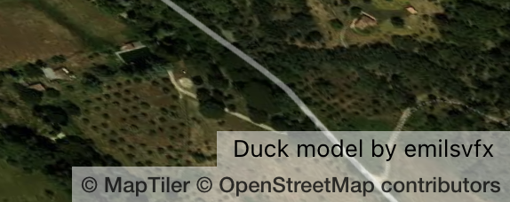
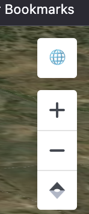

# MapTiler SDK Integration Code Test

This project demonstrates the integration of the MapTiler SDK with a 3D model of a rubber duck rendered using Three.js.

A live version is available [here](https://lesbaa.github.io/-maptiler-sdk-test/). The code is available [here](https://github.com/lesbaa/-maptiler-sdk-test).

## Project Structure

```
.
├── .github/workflows/static.yml
├── public/models/rubber_duck/
├── src/
│   ├── 3DModel/
│   ├── ModelAttributionControl/
│   ├── ProjectionToggleControl/
│   ├── map/
│   ├── consts.ts
│   ├── global.css
│   ├── globals.d.ts
│   ├── main.ts
│   └── vite-env.d.ts
├── .gitignore
├── index.html
├── package.json
├── readme.md
└── tsconfig.json
```

## Getting Started

### Prerequisites

- Node.js (v18.20.3)
- npm

### Installation

1. Clone the repository:
    ```sh
    git clone git@github.com:lesbaa/-maptiler-sdk-test.git
    ```

2. Install dependencies:
    ```sh
    npm install
    ```

To run locally, you will need a maptiler API key whitelisted to use localhost. The key for "production" (github pages) is set in github secrets and has domain blocking to only be called from `lesbaa/github.io`.

1. Create a .env file in the root directory and add your MapTiler API key:
    ```sh
    VITE_MAPTILER_API_KEY=your_maptiler_api_key
    ```

### Development, build

To start the development server:
```sh
npm run dev
```

To build the project for production:
```sh
npm run build
```

### To build the project for deployment to GitHub Pages

To deploy the project to GitHub Pages:
```sh
npm run build:ghpages && git push origin main
```

## Project Details & Approach

## UI / Libs etc.

I opted to go for vanilla JS and forego any UI library as most of the UI is taken care of by the map library, and adding an additional library like React, Vue Svelt etc was un-necessary and would only add a layer of additional build complexity and coding complexity. It just simply didn't seem necessary.

Having said all that, whilst MapTiler has its own 3D plugin for applying objects to MapTiler maps, I wanted to show that I was able to integrate with 3rd party libs (in this case three.js). Also, it's fun 🤷🏼‍♂️.

I used three for the 3D part as this is what I'm most familiar with. It's the industry standard for 3D graphics on the web, and is fully featured, allowing me to use whaqt I need but with scope for more advanced features if needed, like animations, effects etc etc.

### 3D Model Integration

The 3D gltf model of a rubber duck is integrated using Three.js. The model is loaded and added to the map as a custom layer via the [CustomLayerInterface](https://maplibre.org/maplibre-gl-js/docs/API/interfaces/CustomLayerInterface/). The logic for this is found in `src/3DModel/3DModel.ts`.

The model, scene and lighting are created and rendered with Three.js with projection to map / world / mercator / globe space taken care of by applying the MV matrix from the `Map.transform.getMatrixForModel()` function. This is mostly taken  from the docs [here](https://maplibre.org/maplibre-gl-js/docs/API/interfaces/CustomLayerInterface/) and [here](https://maplibre.org/maplibre-gl-js/docs/examples/add-3d-model/). The elevation for the model is queried via `Map.queryTerrainElevation(this.modelLngLat)`

#### Additional notes / differences to the docs
- I namespaced the three classes under a `three` object within the customlayer definition, extending the `CustomLayerInterface`. This was just to a implement a clear separation between three-land and maplibre-gl-land.
- I added and additonal `temp` field within this populated with any objects that are used regularly (eg) on every frame to avoid having to reinstantiate a new object on every frame. Whilst this isn't a problem on a small scale, on larger scales it would have an effect on render performance.
- Passing additonal config, such as the model path, base altitude could have been possible. However, for the pruposes of this test, I felt it was probably overkill.

### Custom Controls

- **ProjectionToggleControl**: A control to toggle between globe and Mercator projections. I am aware that MapTiler already provides this control, but I wanted to create one from scratch to show I understand how the SDK operates.
- **ModelAttributionControl**: A control to display attribution information for the 3D model. Another custom control to hide / show a simple (and ugly 😅) dialog linking to the model and artist on sketch fab.

## Time taken

Overall, I think I spent ~4 hours, maybe a bit more. The biggest blocker was the slow feedback setting up and testing github actions to build and deploy the project. Because, [https://stackoverflow.com/questions/59241249/how-can-i-run-github-actions-workflows-locally](it's difficult to do this locally).

It also took me some time to find the _correct_ way of dealing with applying the matrix transformations for the transformation of the three scene correctly with respect to the map (not all docs are up to date / correct).

## Screenshots





## Wishlist

- some more time to audit performance and optimize things where possible.
- better, more consistent structure and naming for styling.

## Additional Docs
- [Three.js](https://threejs.org/docs/)
- [GLTF loader](https://threejs.org/docs/index.html?q=gltf#examples/en/loaders/GLTFLoader)
- [CustomLayerInterface](https://maplibre.org/maplibre-gl-js/docs/API/interfaces/CustomLayerInterface/)

## Model Attribution

Model Information:
* title:	Rubber Duck
* source:	https://sketchfab.com/3d-models/rubber-duck-a84cecb600c04eeba60d02f99b8b154b
* author:	emilsvfx (https://sketchfab.com/emilsvfx)

Model License:
* license type:	CC-BY-4.0 (http://creativecommons.org/licenses/by/4.0/)
* requirements:	Author must be credited. Commercial use is allowed.

If you use this 3D model in your project be sure to copy paste this credit wherever you share it:
This work is based on "Rubber Duck" (https://sketchfab.com/3d-models/rubber-duck-a84cecb600c04eeba60d02f99b8b154b) by emilsvfx (https://sketchfab.com/emilsvfx) licensed under CC-BY-4.0 (http://creativecommons.org/licenses/by/4.0/)
